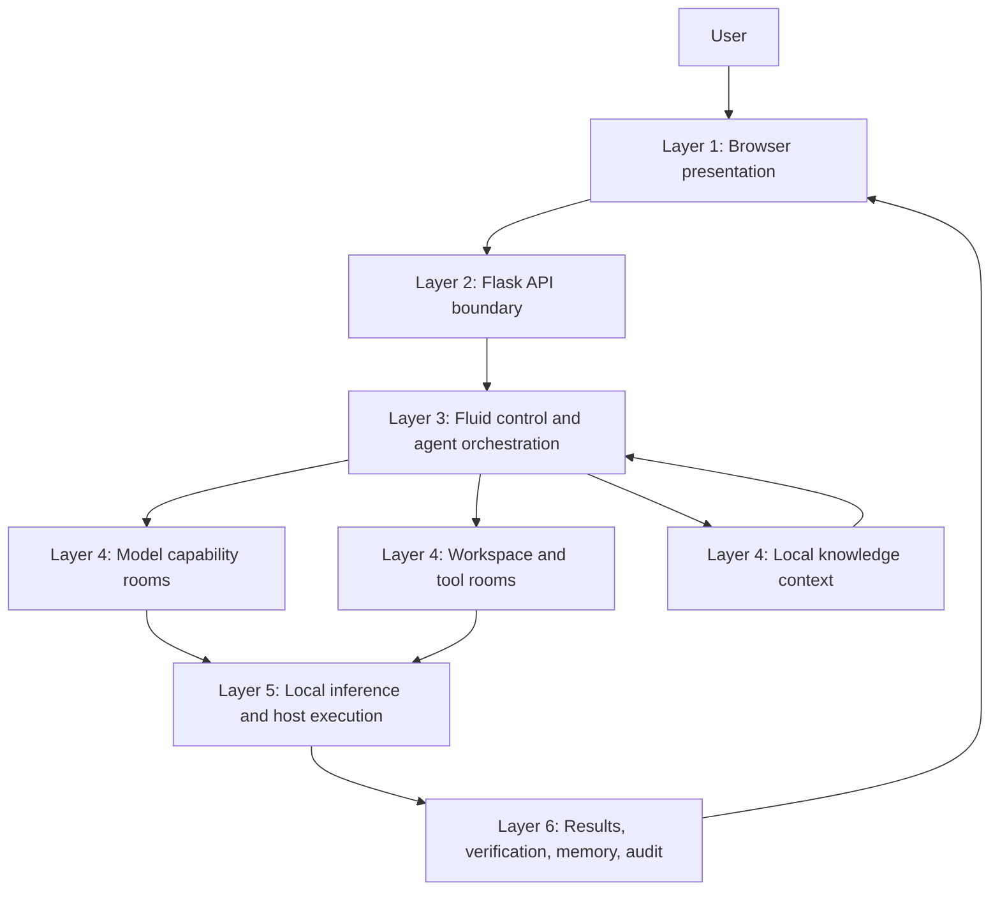

# Sanctum Architecture, Fluid Pipeline, and Technology Flow

## Purpose of this document

This document explains Sanctum as a running system rather than as a list of source files. It answers four questions:

1. How does a user's action move through the product?
2. What is Sanctum-Fluid, what layers and components does it contain, and how do those components cooperate?
3. What happens to workspace data, model context, tools, memory, and results during a request?
4. Which languages, frameworks, libraries, infrastructure, and design principles make the system work?

The description is based on the current implementation. Where the project documentation describes a stronger boundary than the code currently enforces, this document calls that out explicitly.

---

## 1. Product in one sentence

Sanctum is a local-first agent studio: a browser interface sends a user's request to a Flask backend, Fluid selects an available local model, the agent adds conversation and workspace knowledge, approved tools perform local work, and the result is streamed back with an activity trace.

The primary data path is:

```text
User -> Browser UI -> Flask API -> CodingAgent -> Fluid routing
     -> local model -> optional tool execution -> verification
     -> memory/history -> streamed response -> Browser UI
```

The system is designed around a local boundary:

```text
Workspace data -> approved local tools -> local model endpoint
```

The default inference endpoint is loopback infrastructure such as Ollama at `127.0.0.1`. Sanctum does not send the normal agent request to a hosted AI provider.

---

## 2. Runtime actors and boundaries

### 2.1 The user

The user works through the browser UI. Typical activities are:

- Ask the agent a question or request an action.
- Select a workspace directory.
- Browse and read workspace files.
- Create or edit files through natural language.
- Run Python or terminal validation.
- Index local documents into the Local Knowledge Base (LKB).
- Search the LKB directly or let the agent use it automatically.
- Inspect available models and routing profiles.
- Generate Word, PDF, PowerPoint, Excel, or Markdown output.
- Lock or unlock a file through Sanctum Locker.

### 2.2 The browser client

The browser is a presentation and interaction layer. It renders HTML, CSS, and JavaScript and calls backend endpoints. It does not directly access the file system or the local model server.

Short operations use JSON requests. Long-running agent conversations use Server-Sent Events (SSE), which lets the interface show routing, planning, knowledge retrieval, tool, verification, and completion events while the request is running.

### 2.3 The Flask application

Flask is the local application boundary. It:

- Creates the application and injects shared services.
- Validates incoming request data.
- Exposes JSON APIs for the UI.
- Starts the agent execution thread for streamed chat.
- Converts agent events into SSE messages.
- Exposes system, model, tool, workspace, LKB, Fluid, health, and Locker operations.

### 2.4 The agent runtime

`CodingAgent` is the central coordinator. It does not itself generate the answer. It builds the model context, binds tools, invokes the selected model, dispatches tool calls, adds results back to the conversation, and decides when the loop is complete.

### 2.5 The local model server

Sanctum connects to an OpenAI-compatible server running on the local machine. Ollama is the documented default, but LM Studio, llama.cpp, or vLLM can be used when they expose the compatible API.

The model server is responsible for inference. Sanctum is responsible for selecting the model, controlling the prompt, exposing tools, and managing local context.

### 2.6 The active workspace

The workspace is the user's selected local directory. Normal file, workspace, document, Python, terminal, history, and LKB operations are scoped to this directory.

The active workspace is a data boundary, not a user-authentication boundary. It protects paths from escaping the configured root, but it does not provide multi-user access control.

---

## 3. Complete user request flow

This is the most important flow in the system.

### Step 1: Application startup

When `app.py` starts Flask, the application factory constructs the runtime in dependency order:

1. `LLMManager` validates the local inference URL and creates the OpenAI-compatible chat client.
2. `ModelRegistry` loads global model capability profiles.
3. `ModelProfiler` is prepared to benchmark new local models.
4. `WorkspaceRegistry` loads known workspaces.
5. `FluidRouter` is created with the registry, profiler, and LLM manager.
6. The configured workspace is created or restored.
7. `WorkspaceHistoryManager` is attached to that workspace.
8. `LKBManager` loads the workspace knowledge directory.
9. `CodingAgent` receives all shared services and builds the LangChain tool set.
10. Flask registers the routes and serves the browser.

At this point the browser can discover runtime state through `/api/system`, models through `/api/models`, tools through `/api/tools`, and workspace data through `/api/workspace/*`.

### Step 2: User selects or confirms a workspace

The initial workspace comes from the `WORKSPACE` environment variable, defaulting to `workspace`. A saved path can be restored from `.sanctum_workspace`.

When the user selects another directory:

1. The browser sends the path to `/api/workspace/select`, or uses `/api/workspace/pick` for the native folder picker.
2. The agent validates that the path exists and is a directory.
3. `ToolManager` moves all workspace-aware tools to the new root.
4. `DocumentGenerator` changes its output root.
5. Workspace history is replaced with a manager for the new workspace.
6. The LKB manager reloads `.sanctum/knowledge` under the new root.
7. The selected root is persisted for the next startup.
8. The workspace registry records the workspace and last-opened time.

The server-side agent state is authoritative. Browser state is only a display and convenience layer.

### Step 3: User enters a chat request

The normal UI sends:

```text
POST /api/chat/stream
{
  "message": "Create a Python file that prints numbers from 1 to 10"
}
```

The route strips and validates the message. Empty requests are rejected before entering the agent.

### Step 4: Streaming execution begins

Flask creates a queue and starts a daemon thread for `CodingAgent.chat`. The request thread remains responsible for reading that queue and yielding SSE messages:

```text
data: {"type":"activity", "stage":"routing", ...}

data: {"type":"activity", "stage":"tool", ...}

data: {"type":"result", "reply":"...", ...}
```

This separates the browser's live response from the internal agent loop while preserving a single logical request.

### Step 5: Fluid classifies and routes the task

The agent emits a routing event and calls `FluidRouter.route(message)`.

The router:

1. Discovers models from the local server's `/models` endpoint.
2. Starts background profiling for newly seen models when needed.
3. Classifies the request as `code`, `vision`, `reasoning`, `docs`, or `general` using local pattern rules.
4. Asks `ModelRegistry` for the highest-scoring available model for that category.
5. Changes the active `ChatOpenAI` client if the selected model differs.
6. Returns the active model name.

If only one local model exists, that model handles every category.

### Step 6: Context is assembled

The agent records the user message in two places:

- `MemoryManager` for the current process conversation context.
- `WorkspaceHistoryManager` for persistent per-workspace history.

If the LKB contains indexed content, the request is searched against the local TF-IDF index. The top relevant chunks are formatted and appended to the system prompt.

The final model input consists of:

```text
System instructions
+ workspace history summary
+ relevant LKB context, if found
+ recent in-session conversation messages
+ current user message
```

The agent uses the most recent conversation window rather than sending an unlimited history to the model.

### Step 7: The selected model reasons

The selected model is invoked through a LangChain `ChatOpenAI` client with the current tool definitions bound using `bind_tools(..., tool_choice="auto")`.

The model may return:

- A normal assistant answer.
- One or more native tool calls.
- An XML-like fallback tool call such as `<function/...>` for models that do not emit native tool calls correctly.

### Step 8: Tools execute when required

For each tool call, the agent:

1. Identifies the tool name and arguments.
2. Emits a tool activity event.
3. Invokes the matching LangChain wrapper.
4. The wrapper delegates to `ToolManager` or `DocumentGenerator`.
5. The local operation returns a structured result.
6. The agent records the action.
7. The result is added as a `ToolMessage`.
8. A verification event is emitted.

The model then receives the result and may request another tool. The loop allows up to six tool iterations.

### Step 9: Special completion handling

After the model loop, the agent has additional completion logic for common requests:

- If the user clearly requested a file but the model failed to call a file tool, the agent attempts to derive content and create the file.
- It reads a newly created file back to confirm the write when using this fallback path.
- If the user requested a document and no document tool was called, it parses the generated text into sections and creates a Word document.

These paths exist to make natural-language creation requests reliable, but they are fallback behavior rather than a separate agent subsystem.

### Step 10: Final state is persisted

The final response is added to:

- In-memory conversation history.
- The legacy `workspace/history.json` history maintained by `MemoryManager`.
- The active workspace's `.sanctum/history.json` through `WorkspaceHistoryManager`, with model and tool metadata.

The result includes:

- `reply`
- `tool_actions`
- `activity_events`

### Step 11: The browser renders the result

Flask sends the final SSE event. The browser displays the assistant response and activity trace. Workspace screens can then reload the tree and open generated files.

The current implementation does not automatically reload the workspace tree after every chat operation, so the visible tree may require a workspace refresh/navigation action after a file is created.

---

## 4. Sanctum-Fluid architecture

### 4.1 What Fluid means

Fluid describes the controlled movement of a request through multiple capabilities:

```text
classify -> select model -> retrieve context -> reason -> use tools
         -> inspect result -> continue or finish -> record -> return
```

Fluid is not a second web server and not a hosted orchestration product. It is the coordination architecture inside the Sanctum process.

### 4.2 Layer model

The practical architecture has six functional layers:



The layers are logical responsibilities. They are not separate deployment containers.

---

## 5. Fluid layers in detail

### Layer 1: Presentation layer

**Purpose:** Give the user an observable, usable control surface.

**Components:**

- HTML template for the application shell.
- CSS layout and visual states.
- Browser JavaScript state management.
- Overview, workspace, agent, models, LKB, tools, security, and Locker screens.
- SSE reader for live agent activity.
- File tree and code/document viewer.
- Model selection and routing preview controls.
- LKB index/search controls.
- Locker file upload and download flow.

**Responsibilities:**

- Collect user intent.
- Display current model, endpoint, workspace, and tool state.
- Show the agent's progress events.
- Render results and errors.
- Request refreshed state from the API.

**Strength:** The UI exposes operational state instead of hiding the system behind a single chat box. A user can inspect models, tools, workspace files, routing, knowledge, and local-security information.

**Boundary:** The browser is not trusted with direct host access. It asks the backend to perform all privileged operations.

### Layer 2: API gateway layer

**Purpose:** Provide a stable local HTTP boundary between the browser and runtime services.

**Components:**

- Flask application factory.
- Route blueprint.
- JSON request and response handling.
- SSE response generator.
- Workspace path validation at API entry points.
- Health and system information endpoints.

**Responsibilities:**

- Validate message, path, model, query, upload, and passphrase inputs.
- Select the service that owns each operation.
- Keep browser protocol concerns separate from agent logic.
- Convert internal results into JSON or streamed events.

**Strength:** Routes make the runtime inspectable and easy to integrate with another local client.

**Boundary:** Routes should validate and delegate; they should not decide model reasoning or perform direct business logic beyond endpoint-specific orchestration.

### Layer 3: Fluid control layer

**Purpose:** Decide how a request should be processed and coordinate the request lifecycle.

**Components:**

- `CodingAgent`: main execution loop.
- `FluidRouter`: task classification and model selection.
- `ModelRegistry`: persistent capability profiles.
- `ModelProfiler`: benchmark-based profile refinement.
- `PromptManager`: system behavior and operating rules.
- `MemoryManager`: current conversation context.
- `WorkspaceHistoryManager`: persistent workspace conversation record.
- `LKBManager`: local retrieval and context formatting.
- LangChain tool wrappers.

**Responsibilities:**

- Turn a natural-language request into a controlled execution plan.
- Choose the best available model category.
- Build model context.
- Make approved capabilities visible to the model.
- Run the model/tool loop.
- Capture activity and results.
- Stop after a final answer or iteration limit.

**Strength:** It separates intent routing, context retrieval, execution, and persistence while keeping them coordinated in one local process.

**Important behavior:** The agent is stateful and process-wide. Concurrent requests share mutable model and tool state, which is a current limitation for multi-user or highly concurrent operation.

### Layer 4: Capability rooms

This layer contains the logical areas from which the agent obtains capability and context.

#### Model rooms

Each available model has a profile with scores for:

- Code.
- Documentation.
- Reasoning.
- Vision.
- General-purpose work.

A model name is discovered from the local model server. The registry first creates a heuristic profile based on name hints, then the profiler can benchmark it.

**Model selection flow:**

```text
model server /models
    -> available model names
    -> heuristic or benchmark profiles
    -> task category
    -> highest score for category
    -> active local model client
```

**Newness:** Model choice is capability-based rather than a single hard-coded model choice. The system can adapt when additional local models become available.

**Actual boundary:** Model rooms are logical profiles. The code maintains one mutable active model in `LLMManager`; it does not create independent model processes, isolated memory stores, or separate security contexts for each model.

#### Workspace room

The active workspace contains:

- User project files.
- Workspace history.
- Workspace profile metadata.
- LKB index metadata.
- LKB vector persistence.
- Generated documents.

All ordinary workspace tools resolve paths under this root and reject paths that escape it.

**Newness:** Workspace selection changes the roots of multiple services together, keeping tools, documents, history, and knowledge aligned to the same active project.

#### Tool rooms

Tools are grouped by the type of local capability they provide:

1. **File operations:** create, read, write, delete, and rename files.
2. **Workspace inspection:** list files, show a directory tree, and read metadata.
3. **Execution:** run Python code/scripts and run tokenized terminal commands.
4. **Document generation:** create XLSX, PPTX, DOCX, PDF, and structured Markdown notes.

The model asks for a named capability. The wrapper executes it and returns a structured result rather than giving the model direct file-system access.

#### Knowledge room

The LKB is a workspace-scoped retrieval source. It is not a remote vector database. It reads selected local text and code files, breaks them into overlapping chunks, calculates TF-IDF vectors, and retrieves relevant chunks for a request.

### Layer 5: Local execution layer

**Purpose:** Perform the physical work requested by the agent.

**Execution targets:**

- Local OpenAI-compatible model server.
- Workspace file system.
- Python interpreter used by the application.
- Host shell commands executed with `shell=False` and a workspace working directory.
- Local document libraries.
- Temporary directories used by Locker uploads.

**Strength:** The execution path can operate offline and keeps the workspace and inference endpoint on the host.

**Security qualification:** Path containment is not equivalent to process sandboxing. The Python tool runs arbitrary Python using the application interpreter. The terminal tool runs host processes. These tools are appropriate for a trusted local developer environment, but they are not a hardened security sandbox.

### Layer 6: Verification, persistence, and return layer

**Purpose:** Turn execution into a trustworthy user-visible result.

**Components:**

- Tool result messages.
- Activity events.
- File read-back verification in file fallback flows.
- Generated-document success/error checks.
- In-memory history.
- Workspace history.
- Loguru logging.
- Final SSE response.

**Strength:** The user sees what the agent is doing, which model was selected, which tools ran, and what the final result was.

**Actual implementation:** Verification is distributed across agent logic and tool results. There is not currently a standalone verification service or policy engine.

---

## 6. Model routing and profiling flow

### 6.1 Classification categories

The router uses local regular-expression rules to classify the request:

- `code`: programming, debugging, APIs, algorithms, source files, tests.
- `vision`: images, screenshots, diagrams, charts, visual analysis.
- `reasoning`: analysis, comparison, tradeoffs, equations, deduction.
- `docs`: documents, reports, summaries, guides, manuals, notes.
- `general`: requests that do not match a more specific category.

The first matching category wins, so classification is heuristic and order-sensitive.

### 6.2 Capability registry

Profiles are persisted globally under `~/.sanctum/global_model_registry.json`, separate from workspace data. The default profile gives every model baseline scores. Name patterns can boost likely strengths before benchmarking.

### 6.3 Background profiler

A newly detected model is benchmarked asynchronously using short prompts for code, documentation, and reasoning. The profiler counts expected signals, applies a speed factor, estimates vision support from model naming, derives a general score, and stores the result.

This means routing can work immediately using heuristic scores while improving over time.

### 6.4 Routing decision

For multiple models:

```text
request -> category -> profile lookup -> maximum category score -> model switch
```

For one model:

```text
request -> available model -> use that model for every category
```

### 6.5 Routing APIs

The UI can inspect routing without changing the active model through `/api/fluid/route`. The full registry and capability matrix are available through `/api/fluid/registry`. Manual background profiling is available through `/api/fluid/profile`.

---

## 7. Local Knowledge Base flow

### 7.1 Indexing flow

1. User selects a file or directory to index.
2. The browser calls `/api/lkb/index`.
3. The API resolves the path relative to the active workspace.
4. Paths outside the workspace are rejected.
5. Supported text/code extensions are read locally.
6. Content is split into approximately 400-word chunks with 50-word overlap.
7. File metadata and chunk counts are written to `.sanctum/knowledge/index.json`.
8. TF-IDF vectors are rebuilt with scikit-learn.
9. The vectorizer, matrix, text, and metadata are persisted to `tfidf_vectors.pkl`.

Directory indexing is limited to the first 100 matching files in one batch.

### 7.2 Search flow

1. User searches through `/api/lkb/search`, or an agent request enters `CodingAgent.chat`.
2. The searcher transforms the query into a TF-IDF vector.
3. Cosine similarity ranks indexed chunks.
4. If vector search is unavailable, keyword overlap is used.
5. The top results are returned.
6. For agent context, the top four results are formatted and truncated to an approximate 800-word budget.
7. The context is appended to the system prompt.

### 7.3 LKB strengths

- Fully local and offline.
- No embedding API or cloud vector store required.
- Useful for code, notes, specifications, and project documentation.
- Scoped to the active workspace.

### 7.4 LKB limitations

- Changed files must be re-indexed; there is no automatic file watcher.
- Persisted vectors use Python pickle and should only be loaded as trusted local data.
- TF-IDF is lexical retrieval, not deep semantic retrieval.
- The index records file metadata but does not automatically remove stale entries when files disappear.

---

## 8. Tool execution flow

### 8.1 Common contract

The model sees LangChain-compatible functions with names, descriptions, and arguments. The agent maps a model call to a wrapper. The wrapper calls the appropriate local manager and serializes the result back into the conversation.

```text
LLM tool call
    -> agent tool lookup
    -> LangChain wrapper
    -> ToolManager or DocumentGenerator
    -> workspace/local process
    -> structured result
    -> ToolMessage
    -> next model turn
```

### 8.2 File and workspace operations

File operations resolve the requested path against the active root and call `Path.relative_to(root)` to reject path traversal. Create, read, write, delete, and rename operations are supported.

Workspace inspection provides directory trees, recursive file listings, and file metadata. These operations are also rooted in the active workspace.

### 8.3 Python execution

The Python tool accepts code or a script path, uses the current application Python executable, runs with a workspace directory, captures stdout and stderr, and applies a timeout.

It is a controlled developer tool, not a secure sandbox. Arbitrary Python can access anything the process account can access.

### 8.4 Terminal execution

The terminal tool tokenizes string commands with `shlex.split`, runs with `shell=False`, uses a workspace working directory, captures output, and applies a timeout.

Using `shell=False` avoids shell-string expansion, but the command can still invoke host executables available to the process account.

### 8.5 Document generation

`DocumentGenerator` produces:

- Excel workbooks through `openpyxl`.
- PowerPoint presentations through `python-pptx`.
- Word documents through `python-docx`.
- PDF reports through `reportlab`.
- Structured Markdown notes through the standard library.

Generated paths are kept inside the active workspace.

### 8.6 MCP-shaped boundary

`LocalMCPServer` exposes tool names, descriptions, workspace scope, protocol metadata, and a call adapter. It is intentionally in-process today and is designed to make a future stdio transport possible.

In the current chat execution path, the agent invokes its LangChain wrappers directly. `LocalMCPServer.call_tool()` is not the mandatory enforcement path for every tool call. Therefore MCP is currently an explicit local capability inventory and adapter, not an independent process or hard security boundary.

---

## 9. Memory, history, and workspace data flow

Sanctum has more than one kind of memory.

### 9.1 In-session conversation memory

`MemoryManager` stores user and assistant messages in process memory and persists a legacy copy to `workspace/history.json`. The agent uses recent messages to build the next model context.

### 9.2 Workspace history

`WorkspaceHistoryManager` keeps a persistent history under the active workspace's `.sanctum` area and stores a summary/profile used by the UI and prompt composition. It is switched when the active workspace changes.

### 9.3 Global model memory

Model profiles are stored under the user's home directory at `~/.sanctum/global_model_registry.json`. They are intentionally global rather than workspace-specific.

### 9.4 Workspace registry

Known workspace paths and usage metadata are stored under `~/.sanctum/workspace_registry.json`. This registry tracks workspaces; it does not enforce OS permissions or user authorization.

### 9.5 Isolation caveat

Workspace history and LKB are switched with the active workspace. The legacy `MemoryManager` remains process-global and is initialized from the original configured workspace. This means the current implementation has strong path and service scoping, but not perfect conversation-memory isolation after workspace switching.

---

## 10. Sanctum Locker flow

Locker is a file-protection feature with two surfaces.

### Integrated flow

The main app exposes:

- `POST /api/locker/lock`
- `POST /api/locker/unlock`

The browser sends multipart form data with a file and passphrase. The route:

1. Sanitizes the uploaded filename.
2. Creates a temporary directory.
3. Saves the upload temporarily.
4. Calls `sanctum-locker` to lock or unlock it.
5. Streams the result as a download.
6. Cleans up temporary files after the response.

Locker is separate from the agent's workspace tool loop. A user invokes it through a dedicated UI action rather than asking the model to protect a file.

### Standalone Locker application

The `sanctum-locker` directory contains a parallel Flask application with its own HTML routes, upload directory, output directory, and lock/unlock pages. It is not mounted into the main Flask application.

---

## 11. Technology stack flow

### 11.1 Programming languages

- **Python:** Backend, agent orchestration, model integration, tools, indexing, document generation, and Locker server.
- **JavaScript:** Browser state, API calls, SSE consumption, file tree rendering, editor behavior, and Locker upload/download.
- **HTML/Jinja:** Server-rendered application shell and templates.
- **CSS:** Interface layout, theme, responsive presentation, and activity states.
- **JSON:** API payloads, history, model profiles, workspace metadata, and LKB metadata.

### 11.2 Web and server stack

- **Flask:** Local HTTP server, routing, application factory, JSON APIs, and SSE responses.
- **Werkzeug:** Flask's WSGI and request/file utilities.
- **Jinja2:** HTML template rendering.
- **python-dotenv:** Environment configuration loading.
- **Click and Blinker:** Flask ecosystem support.

### 11.3 Agent and model stack

- **LangChain:** Tool abstractions and model message/tool orchestration.
- **langchain-core:** `SystemMessage`, `HumanMessage`, `AIMessage`, `ToolMessage`, and tool decorators.
- **langchain-openai:** `ChatOpenAI` client pointed at the local OpenAI-compatible endpoint.
- **LangGraph and related packages:** Installed for agent ecosystem support, although the current central loop is implemented directly in `CodingAgent`.
- **Pydantic and pydantic-core:** Structured validation used by the ecosystem.
- **Tenacity, anyio, httpx, httpcore, requests, urllib3, websockets:** Retry, asynchronous, HTTP, and transport support used across dependencies and local integrations.
- **LangSmith:** Installed ecosystem package; the local architecture does not require a hosted tracing path for normal operation.

### 11.4 Local model infrastructure

The model endpoint follows the OpenAI-compatible API shape. The code validates that the hostname is one of:

- `127.0.0.1`
- `localhost`
- `::1`

The default base URL is `http://127.0.0.1:11434/v1`, commonly used with Ollama. The configured model can be supplied through `LOCAL_LLM_MODEL`.

### 11.5 Knowledge retrieval stack

- **scikit-learn:** `TfidfVectorizer` and vector similarity.
- **NumPy:** Numeric array operations for ranking scores.
- **pickle:** Local persistence of the vectorizer, matrix, chunks, and metadata.

### 11.6 Document generation stack

- **openpyxl:** XLSX workbooks.
- **python-pptx:** PPTX presentations.
- **python-docx:** DOCX documents.
- **reportlab:** PDF reports.

### 11.7 Logging, serialization, and support packages

- **Loguru:** Application logging.
- **orjson and ormsgpack:** Fast serialization support in the dependency environment.
- **PyYAML:** YAML support.
- **jsonpatch and jsonpointer:** Structured JSON operations.
- **packaging, zstandard, xxhash:** Dependency and performance support.
- **certifi, charset-normalizer, idna, h11, sniffio, colorama, win32_setctime, uuid_utils:** HTTP, platform, encoding, and runtime support packages.

### 11.8 Locker stack

- **sanctum-locker 0.1.1:** File locking and unlocking functionality used by the integrated and standalone Locker surfaces.

### 11.9 Frontend libraries

The main interface is intentionally vanilla HTML, CSS, and JavaScript rather than React or another frontend framework. The template also references Google Fonts and Material Icons at runtime, which is a network-dependent presentation detail despite the local-first application architecture.

---

## 12. Complete feature inventory

This section lists the application's implemented features by user outcome and runtime capability. It is organized around what the application does, rather than around its source files.

### 12.1 Agent workspace features

- Natural-language chat with a local AI model.
- Streaming chat responses through Server-Sent Events.
- Live activity stages for routing, planning, LKB retrieval, reasoning, tool execution, verification, and completion.
- Conversation history in the current session.
- Clear-session-history action.
- Workspace-scoped persistent conversation history.
- Workspace history summaries and message metadata.
- System prompt and persona management.
- Recent conversation context supplied to the model.
- Automatic selection of tools through model tool calls.
- Support for native LangChain tool calls.
- XML-like tool-call fallback for compatible local models that do not emit native calls correctly.
- Bounded agent loop with a maximum of six tool iterations.
- Structured tool-action results returned with the final answer.
- Explicit failure response when a requested file write cannot be confirmed.

### 12.2 File and code features

- Create a new file inside the active workspace.
- Read a complete file.
- Read a selected line range from a file.
- Overwrite or update a file.
- Delete a file.
- Rename or move a file within the workspace.
- Reject file paths that escape the active workspace root.
- Browse the workspace as a directory tree.
- List files recursively or non-recursively.
- Inspect file size, type, and modification metadata.
- Open files in the browser editor.
- Keep multiple editor tabs open.
- Close editor tabs.
- Syntax-aware display for common source-file types.
- Plain-text display for text files.
- Inline PDF preview.
- Download generated or workspace files.
- Automatic file-creation fallback for common natural-language requests.
- Read-back verification for files created through the fallback path.

### 12.3 Code execution and validation features

- Run Python code snippets.
- Run a Python script from the active workspace.
- Capture Python stdout, stderr, return code, and working directory.
- Apply a Python execution timeout.
- Run tokenized terminal commands.
- Execute terminal commands with `shell=False`.
- Capture terminal stdout, stderr, return code, and working directory.
- Apply a terminal execution timeout.
- Keep Python and terminal working directories inside the active workspace.

### 12.4 Document and artifact generation features

- Generate styled Excel workbooks.
- Generate PowerPoint presentations.
- Generate formatted Word documents.
- Generate PDF reports.
- Generate structured Markdown notes.
- Add titles, subtitles, headings, sections, bullet points, callouts, tables, totals, and tags according to the output type.
- Derive document sections from model-generated text when a document request did not directly produce a document-tool call.
- Save generated artifacts under the active workspace.
- Return generated file paths and output formats to the user.

### 12.5 Workspace management features

- Use the configured default workspace.
- Restore the last saved workspace on startup.
- Select an existing workspace by path.
- Open a native folder picker on a local desktop.
- Register known workspaces globally.
- Track workspace name, first-opened time, last-opened time, and message count.
- Switch file, workspace, Python, terminal, document, history, and LKB services to the selected workspace.
- Persist the selected workspace path.
- Keep workspace history and LKB data under the workspace's `.sanctum` directory.

### 12.6 Local Knowledge Base features

- Index one supported local file.
- Index a local directory recursively.
- Index a directory non-recursively.
- Support text, Markdown, source code, configuration, SQL, XML, CSV, and related text formats.
- Split documents into overlapping chunks.
- Store indexed-file metadata.
- Build a local TF-IDF index.
- Persist TF-IDF vectors and metadata locally.
- Search with cosine similarity.
- Fall back to keyword search when vector search is unavailable.
- Return ranked matching chunks with source paths, chunk indexes, scores, and search method.
- Inject the most relevant local context into agent prompts.
- List indexed files.
- Clear the active workspace's LKB.
- Limit agent context to a bounded result set and approximate word budget.

### 12.7 Fluid model and routing features

- Discover models from the local OpenAI-compatible `/models` endpoint.
- Select a model manually from the available local models.
- Classify requests as code, documentation, reasoning, vision, or general.
- Preview a routing decision without changing the active model.
- Route multi-model workloads by capability score.
- Use a single-model fallback when only one model is available.
- Create heuristic profiles for newly discovered model names.
- Profile models in background threads.
- Benchmark code generation capability.
- Benchmark documentation capability.
- Benchmark reasoning capability.
- Estimate vision capability from model naming signals.
- Calculate a general-purpose capability score.
- Persist capability profiles globally.
- Display a routing capability matrix.
- Mark models as heuristically known or benchmarked.
- Remove stored model profiles.

### 12.8 Local model and runtime features

- Connect to Ollama or another OpenAI-compatible local inference server.
- Support LM Studio, llama.cpp, vLLM, or similar compatible servers through configuration.
- Enforce loopback-only model endpoint hostnames.
- Configure model name, endpoint, API key value, timeout, and offline mode through environment variables.
- Use deterministic temperature `0` for the model client.
- Check local model-server health.
- Report active model, endpoint, provider type, and network scope.
- Report available model names.
- Report whether external inference is enabled.

### 12.9 Tools and MCP-shaped capability features

- Publish an inventory of approved tools.
- Publish tool names and descriptions to the UI and runtime status APIs.
- Mark tools as workspace-local.
- Expose local MCP-style protocol metadata.
- Dispatch registered tools through `ToolManager`.
- Register, unregister, inspect, and execute tool implementations.
- Keep tool roots synchronized when the workspace changes.
- Preserve a future path toward a separate stdio transport.

The current MCP implementation is an in-process boundary and capability inventory. It is not currently a separate MCP server process or the mandatory dispatch path for every agent tool call.

### 12.10 Security and data-boundary features

- Reject non-loopback local model endpoints.
- Resolve workspace paths before access.
- Reject path traversal outside the active workspace.
- Constrain generated document output to the workspace.
- Constrain file downloads and PDF previews to the workspace.
- Sanitize uploaded Locker filenames.
- Use temporary directories for integrated Locker operations.
- Clean up Locker temporary files after responses.
- Expose local-only, endpoint, MCP, workspace, and model status for inspection.
- Provide a dedicated security screen in the UI.

These are local data-boundary protections. Python and terminal execution still run with the host process account's permissions and should be used only in a trusted environment.

### 12.11 Sanctum Locker features

- Lock an uploaded file with a passphrase.
- Unlock a `.locked` file with a passphrase.
- Download the locked result.
- Download the restored result.
- Display lock and unlock progress states.
- Display operation errors.
- Provide a dedicated integrated Locker UI.
- Provide a separate standalone Locker Flask application.

### 12.12 API, operations, and diagnostics features

- Serve the browser application at `/`.
- Provide synchronous chat compatibility through `/api/chat`.
- Provide streamed chat through `/api/chat/stream`.
- Expose system information through `/api/system`.
- List and select models through `/api/models` and `/api/models/select`.
- List tools through `/api/tools`.
- Read and clear session history.
- Read and clear workspace history.
- Inspect workspace trees, files, metadata, previews, and downloads.
- Select or pick workspaces.
- Index, search, list, and clear LKB content.
- Inspect Fluid registry and routing profiles.
- Start model profiling manually.
- Preview Fluid routing.
- List registered workspaces.
- Lock and unlock files through API endpoints.
- Report application and local-model health through `/health` and `/api/health`.

### 12.13 Logging and observability features

- Log application startup and service initialization.
- Log model discovery and model changes.
- Log profiling progress and scores.
- Log workspace registration and switching.
- Log LKB indexing and search failures.
- Log tool calls and arguments.
- Stream human-readable activity states to the browser.
- Return tool actions and activity events with each chat result.

### 12.14 Feature trust-model summary

The strongest current feature combination is:

```text
local model routing
    + workspace-scoped tools
    + local project retrieval
    + visible execution events
    + persistent history
    + generated artifacts
    + path containment
```

The application is best understood as a trusted, single-user, local developer environment with strong workspace path boundaries and broad host capabilities. It is not yet a multi-user service, a hardened code sandbox, or a fully isolated multi-model runtime.

---

## 13. System design principles

### Local-first execution

Inference, workspace data, retrieval, tool execution, and document generation are designed to remain on the user's machine.

### Explicit capability boundaries

The model does not receive an implicit operating-system API. It receives named tools with descriptions and must request a capability.

### Workspace scoping

File and generated-document paths are rooted in an active workspace and reject path traversal.

### Capability-based model routing

Requests are categorized and routed to the model with the highest stored capability score for the task.

### Progressive enhancement

The router works with one model, multiple models, heuristic profiles, or benchmarked profiles. The LKB works with TF-IDF and has a keyword fallback. The agent supports native tool calls and an XML-like fallback parser.

### Observable execution

The system emits activity stages and exposes system, health, model, routing, tool, workspace, and LKB APIs so the user can inspect runtime behavior.

### Separation of concerns

Presentation, API transport, orchestration, capabilities, local execution, and persistence have distinct responsibilities even though they run in one application process.

### Bounded agent loop

Tool execution is capped at six iterations, preventing an unbounded model/tool cycle.

### Dependency injection at startup

The application factory creates and wires shared services in one place, making the runtime graph visible and replaceable.

### Offline-capable retrieval

The LKB does not require an embedding provider, remote search service, or hosted database.

---

## 13. What is genuinely strong or new in the layer design

### Fluid is more than model selection

The useful idea is not only routing between models. Fluid connects routing, workspace identity, knowledge retrieval, tools, memory, streaming observability, and verification into one request lifecycle.

### Model capability profiles are persistent

The system can remember that one local model is stronger at code while another is stronger at reasoning or vision. This is more adaptable than configuring one model for every request.

### Workspace identity drives multiple services

Switching the active workspace changes the roots for tools, generated documents, history, and LKB together. That reduces accidental cross-project context mixing.

### Local knowledge is a first-class context provider

The LKB is not an afterthought. It can participate in every agent request after indexing, allowing answers to be grounded in the current project without uploading project content.

### The user can observe the agent lifecycle

Routing, knowledge retrieval, reasoning, tool execution, verification, and completion are separate activity stages. This makes an agent action more understandable than a black-box response.

### The architecture is extensible without changing the UI contract

A future tool transport, additional model server, stronger retriever, or richer verification component can fit behind existing service boundaries and API concepts.

### It combines creation and inspection

The same system can create files and documents, inspect workspace state, run validation, and show the result in the UI. This makes it practical for development workflows rather than only conversation.

---

## 14. Current implementation realities and risks

These points are important for an accurate technical understanding.

1. **MCP is currently MCP-shaped, not a separate MCP process.** The server publishes metadata and has a call adapter, but the normal agent path invokes LangChain wrappers directly.
2. **Model rooms are logical, not hard isolation.** A shared mutable LLM manager changes the active model.
3. **Python is not a security sandbox.** It runs with the host process account's permissions.
4. **Terminal execution is not a security sandbox.** It is constrained to a workspace working directory but can launch host programs.
5. **Verification is distributed.** There is no independent verification service.
6. **The process is stateful.** Concurrent requests can contend over the active model, tool roots, and agent state.
7. **LKB freshness is manual.** Files changed after indexing can produce stale context.
8. **Legacy memory is not fully workspace-switched.** Workspace history and LKB switch, but the process-level `MemoryManager` remains tied to its original history file.
9. **The frontend is not fully offline in presentation.** External font/icon references may require network access.
10. **There are currently no meaningful automated tests under `tests/`.** Runtime validation should be expanded as the architecture grows.
11. **The development secret key is a default.** Production deployment should set a strong environment value and disable debug mode.
12. **The main UI uses SSE for chat but conventional JSON for most other operations.** The architecture should not describe every endpoint as streaming.

These are not reasons the architecture cannot be used. They define its current trust model: a trusted local developer environment, one active workspace, one local user, and local model infrastructure.

---

## 15. User operating flow

A new user should understand Sanctum in this order:

### First run

1. Install Python dependencies.
2. Start a local OpenAI-compatible model server.
3. Load at least one model.
4. Set `LOCAL_LLM_BASE_URL` and optionally `LOCAL_LLM_MODEL`.
5. Start the Flask application.
6. Open the local browser address.

### Prepare a project

1. Select a project directory as the workspace.
2. Confirm the workspace tree appears.
3. Inspect the active model and local endpoint on the system/security view.
4. Index useful project files or documentation into the LKB.
5. Open the models/routing view to see available capability profiles.

### Ask the agent to work

1. Describe the desired result in the Agent screen.
2. Watch the routing event to see the selected model category.
3. Watch LKB events when project context is retrieved.
4. Review tool events before relying on the final answer.
5. Inspect generated or modified files in the workspace view.
6. Run a test or validation command through the agent when appropriate.
7. Refresh the workspace tree when the UI has not yet reflected a newly created file.

### Use direct workspace features

- Use Workspace to browse and read files.
- Use Models to inspect or select a local model.
- Use Routing to preview a model decision for a task.
- Use LKB to index, search, list, or clear local knowledge.
- Use Tools to inspect the approved capabilities.
- Use Security/System to inspect loopback and local-boundary information.
- Use Locker when a file needs to be locked or unlocked independently of the agent.

### Understand the result

A successful request is more than the final text. The meaningful result is:

```text
selected model
+ context used
+ tools invoked
+ tool results
+ verification signal
+ persisted history
+ final user response
```

That complete chain is the operational meaning of Sanctum-Fluid.

---

## 16. One-page mental model

```text
The user chooses a workspace and asks for an outcome.

The browser sends the request to Flask.

Flask gives it to CodingAgent.

FluidRouter decides what kind of work it is and chooses the best local model.

The agent combines rules, recent conversation, workspace history, and local
knowledge retrieved from the active project.

The model answers directly or requests named tools.

Tools work only through the local capability layer and normally stay inside the
active workspace. Python and terminal tools execute locally with the host user's
permissions, so they require a trusted environment.

Tool results return to the model until the model can finish or the loop limit is
reached.

The agent records the interaction, emits activity events, and sends the final
answer to the browser through SSE.

The browser shows both the answer and the path taken to produce it.
```

That is the complete architecture flow: a local, workspace-scoped, observable agent pipeline in which Fluid controls movement between intent, model capability, knowledge, tools, execution, and verified response.
